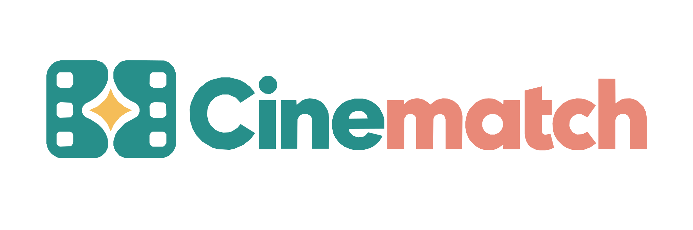
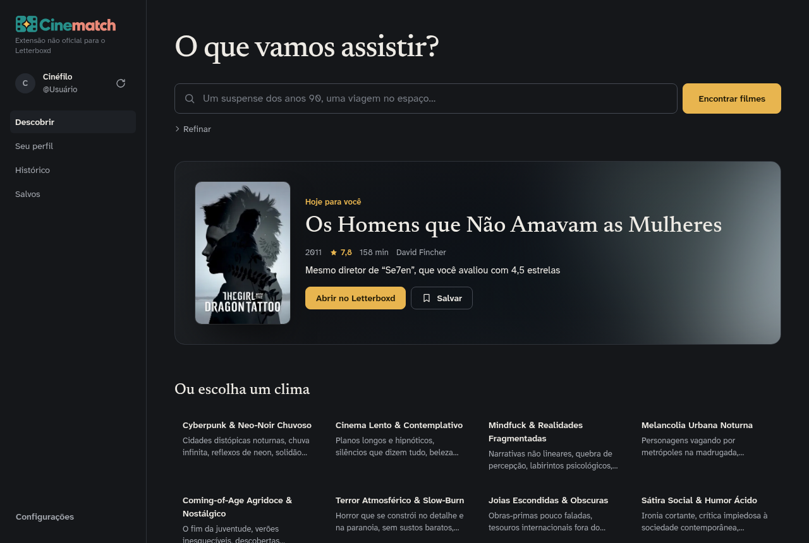
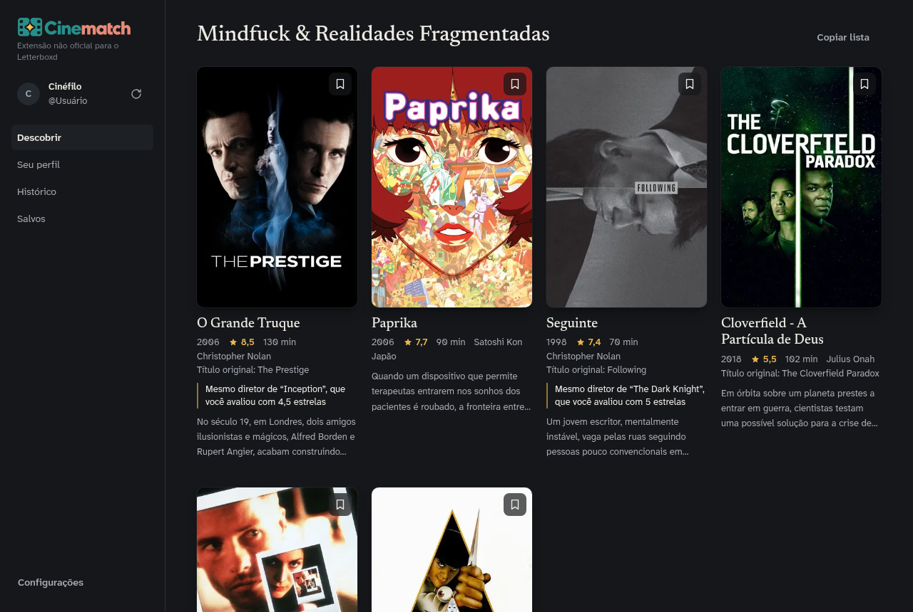
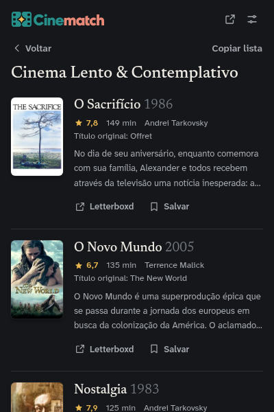

<p align="center"></p>

# CineMatch for Letterboxd (não oficial)

[](https://github.com/bumaruf/cinematch/actions/workflows/ci.yml)

Extensão Manifest V3 para Chrome que recomenda filmes a partir do seu perfil no
Letterboxd. Tudo roda no navegador: o motor de recomendação usa um catálogo
local de cerca de 10 mil filmes e não envia seu perfil a nenhum serviço.

- **Recomendações por clima:** 15 atmosferas curadas, cada uma com um contrato
  de gêneros e sinais temáticos.
- **Busca em linguagem natural:** "terror anos 80", "romance italiano",
  "neo-noir".
- **Filme do dia:** uma indicação diária determinística, baseada no que você
  avaliou bem.
- **Seu perfil, histórico e lista de salvos** no painel.

Não é afiliada ao Letterboxd, ao IMDb nem ao TMDB.

| Painel | Resultados | Popup |
|---|---|---|
|  |  |  |

## Desenvolvimento

Requer Node.js 24 ou mais recente.

O catálogo de filmes é derivado dos datasets do IMDb, licenciados apenas para
uso pessoal e não comercial, por isso não é versionado. Gere-o localmente antes
de usar a extensão (veja [Catálogo](#catálogo)). Para só compilar e testar,
um catálogo vazio basta:

```sh
npm install
npm run catalog:stub   # catálogo vazio: compila e roda os testes que não precisam de filmes
npm run check          # typecheck + testes + build
```

Outros comandos:

```sh
npm run dev        # build em modo de desenvolvimento, com recarga
npm test           # Vitest (os testes com filmes reais rodam só com o catálogo gerado)
npm run e2e        # carrega dist/ no Chromium e testa as telas (requer o catálogo)
npm run package    # gera cinematch-v<versão>.zip para a Chrome Web Store (requer o catálogo)
npm run icons      # regera a logo da interface e os ícones a partir de assets/brand
```

Para instalar, abra `chrome://extensions`, ative o **modo do desenvolvedor**,
clique em **Carregar sem compactação** e selecione a pasta `dist/`.

### CI

O GitHub Actions roda typecheck, testes e build a cada push e pull request,
com o catálogo vazio. O teste de ponta a ponta e o empacotamento precisam do
catálogo real e rodam localmente.

## Arquitetura

O código segue camadas com uma regra de dependência verificada por
`tests/architecture.test.ts`. Detalhes em [docs/architecture.md](docs/architecture.md).

```
src/
  domain/          regras puras: catálogo, perfil, gosto, temas, recomendação
  application/     casos de uso e portas (interfaces que a infraestrutura implementa)
  infrastructure/  chrome.storage, Letterboxd (HTTP, parser, sincronização), catálogo
  messaging/       contrato tipado entre UI e service worker
  background/      service worker: monta as dependências e roteia as mensagens
  ui/              popup, painel, opções, content script e componentes (Tailwind CSS v4)
  data/            dados gerados (não editar à mão)
tools/
  catalog/         pipeline que gera src/data
  diagnostics/     teste de carga do motor e teste de ponta a ponta
  icons/           gera a logo e os ícones a partir de assets/brand
assets/brand/      logo e ícone originais (fonte da marca)
tests/             Vitest
docs/              arquitetura e screenshots
```

A UI conversa com o service worker só pelo contrato de `src/messaging`. Por isso
o catálogo (~9 MB) fica apenas no bundle do service worker, e as páginas abrem
sem carregá-lo.

## Sincronização com o Letterboxd

A sincronização lê as páginas públicas do perfil, reaproveitando a sessão de uma
aba aberta do Letterboxd quando existe (útil quando o site pede verificação).
O histórico é coletado em lotes de 3 páginas, com progresso salvo, para não
ultrapassar o limite de tempo do service worker. Falhas, perfis inexistentes e
coletas incompletas não substituem o perfil salvo. Depois de uma revisão
completa, sincronizações na mesma semana usam o RSS para atualizar só as
atividades recentes.

Também é possível importar `watched.csv`, `ratings.csv` e `diary.csv` da
exportação de dados do Letterboxd.

Mudanças no HTML do Letterboxd podem exigir ajustes em
`src/infrastructure/letterboxd/parse.ts`.

## Catálogo

`src/data/films-dataset.js` é gerado pelos scripts de `tools/catalog`:

```sh
npm run catalog:import    # títulos, anos, gêneros, diretores e notas dos datasets do IMDb (IMDB_CATALOG_LIMIT, padrão 10000)
npm run catalog:enrich    # termos temáticos
npm run catalog:pitches   # sinopses em português via TMDB (TMDB_API_KEY)
npm run catalog:posters   # pôsteres via TMDB (TMDB_READ_ACCESS_TOKEN)
npm run catalog:dedup
```

Os mapas de pôsteres (`src/data/poster-catalog.js`) são versionados; o
catálogo e o checkpoint de sinopses, não.

### Fontes e atribuição

- Informações do [IMDb](https://www.imdb.com), dos datasets para uso pessoal e
  não comercial. Information courtesy of IMDb. Used with permission.
- Sinopses e pôsteres do [TMDB](https://www.themoviedb.org). This product uses
  the TMDB API but is not endorsed or certified by TMDB.

## Dados e privacidade

Perfil, preferências, histórico e filmes salvos ficam em `chrome.storage.local`.
A extensão acessa apenas o Letterboxd (sincronização e pôsteres) e o CDN de
imagens do TMDB. Textos dinâmicos são escapados antes de entrar no HTML, e links
aceitam somente HTTP/HTTPS.

## Licença

Copyright (C) 2026 Contribuidores do CineMatch.

Este programa é software livre: você pode redistribuí-lo e/ou modificá-lo sob os
termos da [GNU General Public License versão 3](LICENSE), publicada pela Free
Software Foundation. É distribuído na esperança de ser útil, mas SEM NENHUMA
GARANTIA; sem mesmo a garantia implícita de COMERCIALIZAÇÃO ou de ADEQUAÇÃO A UM
DETERMINADO FIM.

A licença cobre o código. Os dados de terceiros listados em
[Fontes e atribuição](#fontes-e-atribuição) seguem os termos de cada fonte.
